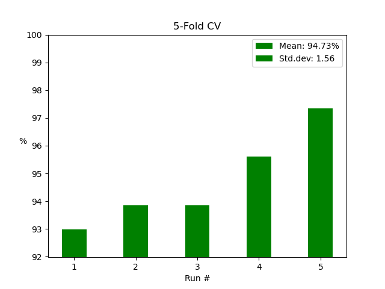
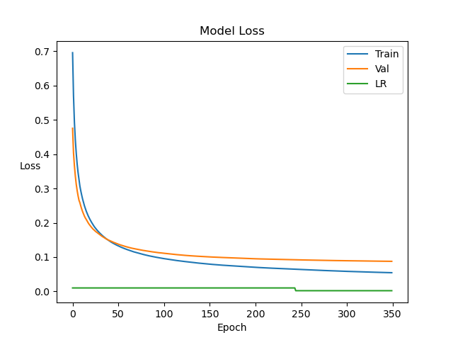
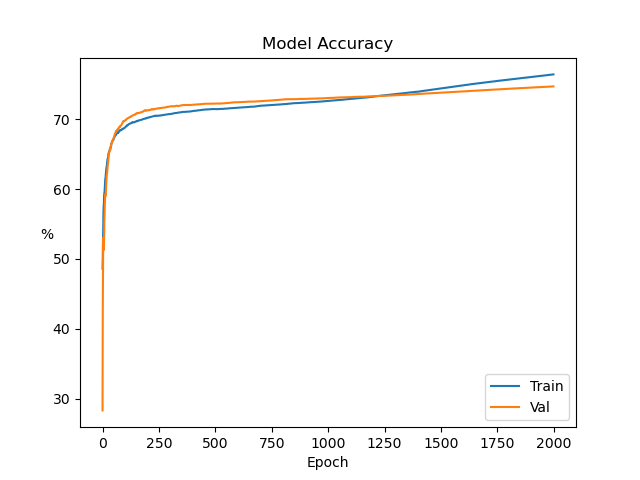

## NumPy Neural Network

This is a Neural Network written in Python by using the NumPy library.

The model implements backpropagation and Stochastic Gradient Descent (SGD) to learn simple datasets.

Important dependencies are NumPy, Scikit-Learn, Pandas and Matplotlib. The exact versions used in this repo are found in requirements.txt, however, this is an auto-generated file from conda on platform osx-arm64 (Mac M1).

The screenshots below are the results from a neural network with 64 nodes in one hidden layer.

### Breast Cancer dataset

|                   Accuracies                   |                     Losses                      |
| :--------------------------------------------: | :---------------------------------------------: |
|  |  |

|                 Predictions                 |                 Target                 |
| :-----------------------------------------: | :------------------------------------: |
|  |  |

|      5-fold Cross Validation       |                 Confusion Matrix                 |
| :--------------------------------: | :----------------------------------------------: |
|  |  |

### Iris dataset

|              Accuracies               |                 Losses                 |
| :-----------------------------------: | :------------------------------------: |
|  |  |

|            Predictions             |            Target             |
| :--------------------------------: | :---------------------------: |
|  |  |

|  5-fold Cross Validation  |            Confusion Matrix             |
| :-----------------------: | :-------------------------------------: |
|  |  |

### Moons dataset

|               Accuracies               |                 Losses                  |
| :------------------------------------: | :-------------------------------------: |
|  |  |

|             Predictions             |             Target             |
| :---------------------------------: | :----------------------------: |
|  |  |

|  5-fold Cross Validation   |             Confusion Matrix             |
| :------------------------: | :--------------------------------------: |
|  |  |

### Wine dataset

|              Accuracies               |                 Losses                 |
| :-----------------------------------: | :------------------------------------: |
|  |  |

|            Predictions             |            Target             |
| :--------------------------------: | :---------------------------: |
|  |  |

|  5-fold Cross Validation  |            Confusion Matrix             |
| :-----------------------: | :-------------------------------------: |
|  |  |

### Digits dataset

|               Accuracies                |                  Losses                  |
| :-------------------------------------: | :--------------------------------------: |
|  |  |

|   5-fold Cross Validation   |             Confusion Matrix              |
| :-------------------------: | :---------------------------------------: |
|  |  |
